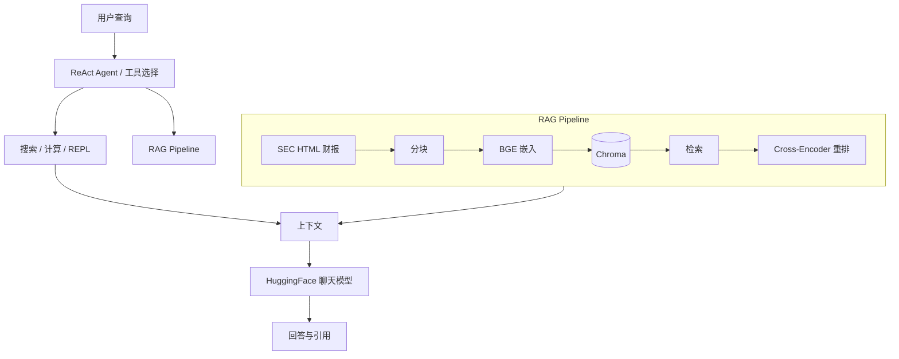

# Finance Agent：多工具 RAG 与金融分析助手

面向 SEC 财报等场景的智能分析项目：结合 **RAG（检索增强）**、**LangGraph ReAct Agent**（自动选用 RAG / 联网搜索 / 计算与代码执行）以及可选的 **LoRA 微调**（`src/train.py`），减轻通用大模型在金融数字与出处上的幻觉问题。

---

## 项目简介

Agent 可根据问题选择工具：从本地向量库检索财报（`rag_search`）、通过 Tavily 联网搜索、或用计算器 / Python REPL 做推导。检索侧支持混合检索与 Cross-Encoder 重排序（见 `src/rag_chain.py`）。

---

## 核心特性

| 能力 | 说明 |
|------|------|
| 多工具编排 | LangGraph `create_react_agent`，工具定义见 `src/tools.py` |
| RAG 管道 | Chroma + BGE 嵌入，混合检索与重排 |
| 数据摄取 | `src/ingestion.py`：SEC EDGAR 下载 10-K / 10-Q（HTML），分块后入库 |
| 微调（可选） | `src/train.py`：QLoRA 与合成 tool-use 样本，可扩展为自有数据集 |
| CLI | `main.py`：交互、单次提问、`--rag-only` 仅检索 |

> **说明**：README 中曾提到的 RAGAS 自动化评估尚未接入仓库代码；若需评估，可自行集成 RAGAS 并配合 `OPENAI_API_KEY` 等作为裁判模型。

---

## 技术架构



---

## 环境要求

- **Python**：`>= 3.11`（见 `pyproject.toml`）
- **GPU**：推理推荐 NVIDIA GPU + 足够显存（默认 `Qwen/Qwen2.5-7B-Instruct`）；无 GPU 可用 `--device cpu` 或更小模型（见 `QUICKSTART.md`）
- **包管理**：推荐使用 [uv](https://github.com/astral-sh/uv)

---

## 安装

```bash
cd finance_agent
uv sync
```

复制环境变量模板并编辑（详见下一节）：

```bash
cp .env.example .env
```

自检：

```bash
uv run setup_check.py
```

> `setup_check.py` 会检查 `notebooks/` 目录；若不存在可执行：`mkdir -p notebooks`。

---

## 环境变量（`.env`）配置说明

在项目根目录创建 **`.env`**（不要提交到 Git）。推荐直接复制模板后逐项填写：

```bash
cp .env.example .env
```

### 必填与强烈建议

| 变量 | 是否必填 | 作用 |
|------|----------|------|
| **`HF_TOKEN`** | **运行 `main.py` 时必填** | 从 [Hugging Face](https://huggingface.co/settings/tokens) 获取，用于下载对话模型等；勿使用占位符 `hf_xxx`。 |
| **`SEC_EMAIL`** | **下载财报时强烈建议** | SEC 要求提供真实联系邮箱；`python src/ingestion.py` 与 `sec_edgar_downloader` 会使用。勿长期使用 `example.com` 等明显占位邮箱。 |

### 可选

| 变量 | 作用 |
|------|------|
| **`TAVILY_API_KEY`** | [Tavily](https://tavily.com/) 联网搜索；不配置则 `web_search` 工具不可用或报错。 |
| **`OPENAI_API_KEY`** | 预留：若你自行接入 RAGAS / 需要 OpenAI 兼容 API 作为裁判或嵌入时使用。 |

### 模型与设备（预留 / 与模板一致）

`.env.example` 中的 `EMBEDDING_MODEL`、`LLM_MODEL`、`DEVICE` 等已写入模板，便于统一约定；**当前入口 `main.py` 以命令行参数为准**（如 `--model`、`--device`）。嵌入与分块等默认值见 `config/model_config.py` 与 `src/ingestion.py`。

### 最小可用示例

```env
# 从 Hugging Face 拉取模型（必填）
HF_TOKEN=hf_你的真实令牌

# SEC 下载身份（强烈建议填真实邮箱）
SEC_EMAIL=you@yourdomain.com

# 需要联网搜索时再填
# TAVILY_API_KEY=tvly_你的密钥
```

保存后执行 `uv run setup_check.py` 确认 `HF_TOKEN`、`SEC_EMAIL` 等项通过检查。

---

## 快速开始

1. **构建向量库**（下载财报 + 分块 + Chroma；首次较慢）：

   ```bash
   uv run python src/ingestion.py
   ```

   若本地已有 `data/sec_filings` 且只想重建向量库，可将 `src/ingestion.py` 中 `RUN_DOWNLOAD = False` 后再运行。

2. **启动 Agent**：

   ```bash
   uv run python main.py
   ```

3. **仅测试检索**：

   ```bash
   uv run python main.py --rag-only --query "What are the main risk factors mentioned?"
   ```

更多示例见 `QUICKSTART.md`。

---

## 项目结构

```text
finance_agent/
├── config/              # 模型与 RAG 等配置（dataclass）
├── data/                # sec_filings、vector_db（运行后生成）
├── notebooks/           # 实验用 Notebook（可选）
├── src/
│   ├── ingestion.py     # SEC 下载与向量库构建
│   ├── rag_chain.py     # 检索与重排
│   ├── tools.py         # Agent 工具
│   ├── agent.py         # LangGraph Agent
│   └── train.py         # LoRA / QLoRA 微调
├── main.py              # CLI 入口
├── setup_check.py       # 环境自检
├── pyproject.toml
└── README.md
```

---

## 开发路线图

当前 **Phase 1～2 主体已在代码中落地**；后续可聚焦评估、演示与数据。

- [x] **Phase 1 — RAG 与数据**：SEC 10-K/10-Q 下载、HTML 加载与分块、Chroma + BGE 向量库（`src/ingestion.py`）
- [x] **Phase 2 — Agent**：Tavily、计算器、Python REPL、RAG 工具、LangGraph ReAct（`src/agent.py`、`src/tools.py`）
- [ ] **Phase 3 — 微调**：扩充真实 tool-use / 金融领域指令数据；QLoRA 训练与评测（`src/train.py` 可扩展）
- [ ] **Phase 4 — 评估与产品化**：RAGAS 或同类指标、Streamlit/Gradio 等界面

---

## 协作与上下文

本 README 可作为 AI 辅助编程或团队协作文档锚点（例如：“继续 Phase 4 的 RAGAS 集成”）。

---

Let's build something amazing.
